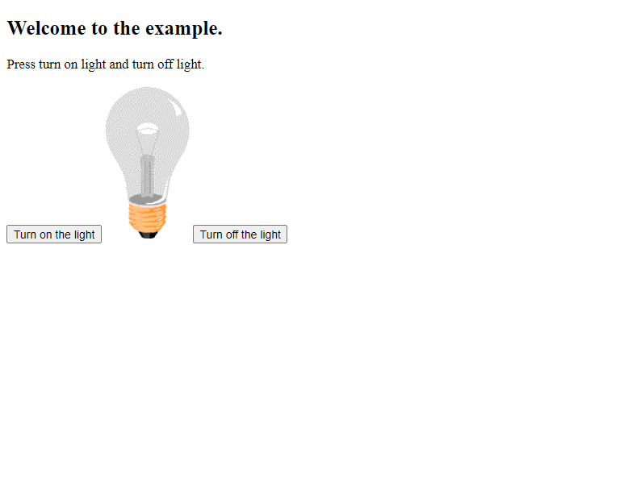

# Projeto em HTML JavaScript

> Exemplo 🚀

O que o JavaScript pode fazer?
JavaScript pode alterar valores de atributo HTML.
Neste caso, o JavaScript altera o valor do atributo src (fonte) de uma imagem.

[🔗 Clique aqui para acessar exemplo](https://eliabesilva317.github.io/exeplo-de-html-javascript/)

## 🛠️ Tecnologias

- HTML
- JavaScript
